# react-github-snake

[](https://www.npmjs.com/package/react-github-snake)
[](https://github.com/akashtdev/react-github-snake/blob/main/LICENSE)
[](https://github.com/akashtdev/react-github-snake)

An interactive GitHub contribution snake game for React. Transform any GitHub contribution heatmap into a playable snake game.



👉 **[Live Studio](https://akashtdev.github.io/react-github-snake/)**

## Features

- **Playable Heatmap**: Turn standard GitHub contribution data into an interactive game.
- **Automode**: Built-in pathfinding that clears the board for you.
- **Export Assets**: Generate static or **animated SVGs** for your GitHub profile README.
- **Responsive**: Dynamically fit columns to container width.
- **Zero Dependencies**: Lightweight and fast.

## Installation

```bash
npm install react-github-snake
```

## Quick Start

```tsx
import { GitHubSnake } from 'react-github-snake';
import 'react-github-snake/style.css';

function App() {
  return (
    <GitHubSnake 
      theme="dark"
      initialMode="AUTOMODE"
      initialSpeed={80}
    />
  );
}
```

## Props

| Prop | Type | Default | Description |
| :--- | :--- | :--- | :--- |
| `data` | `ContributionData` | `undefined` | Manual contribution data object. If not provided, renders an empty board. |
| `theme` | `'light' \| 'dark'` | `'light'` | UI theme preset matching GitHub's aesthetics. |
| `boardWidth` | `number` | `53` | Number of columns in the game board (max 53). |
| `boardHeight` | `number` | `7` | Number of rows in the game board (7 days per week). |
| `initialMode` | `'MANUAL' \| 'AUTOMODE'` | `'MANUAL'` | Starting game mode. |
| `initialSpeed` | `number` | `100` | Delay (ms) between moves. |
| `initialWalls` | `boolean` | `false` | Enable wall-collision (game over on edge hit). |
| `initialSound` | `boolean` | `true` | Toggle spatial audio feedback. |
| `initialGrow` | `boolean` | `false` | Enable snake body growth when eating contributions. |
| `initialShowScore` | `boolean` | `true` | Show score HUD during gameplay. |
| `initialShowHeader` | `boolean` | `true` | Show user identity header. |
| `blockSize` | `number` | `15` | Cell size in pixels. |
| `blockMargin` | `number` | `4` | Gap between cells in pixels. |
| `responsive` | `boolean` | `false` | Dynamically fit columns to container width. |
| `columns` | `number` | `undefined` | Force a specific number of columns (overrides boardWidth). |
| `showLabels` | `boolean` | `true` | Show month labels above the grid. |
| `showLegend` | `boolean` | `true` | Show the legend and contribution count. |
| `scrollable` | `boolean` | `false` | Enable horizontal scrolling for overflow. |
| `labels` | `GitHubSnakeLabels` | `undefined` | Custom text labels for UI elements. |
| `className` | `string` | `''` | Additional CSS class for the container. |
| `style` | `React.CSSProperties` | `undefined` | Inline styles for the container. |

### Export Options

The `useGitHubSnakeExport` hook supports:
- `theme`: `'light' | 'dark'`
- `radius`: `'square' | 'sm-rounded' | 'md-rounded' | 'xl-rounded'`
- `showHeader`: `boolean`
- `showLabels`: `boolean`
- `showLegend`: `boolean`

## Advanced Usage

For external control or multi-component synchronization, wrap your application in the `SnakeProvider` and use the `useSnakeContext` hook.

```tsx
import { SnakeProvider, GitHubSnake, useSnakeContext } from 'react-github-snake';

function CustomControls() {
  const { startGame, stopGame, gameState } = useSnakeContext();
  return (
    <button onClick={gameState === 'PLAYING' ? stopGame : startGame}>
      {gameState === 'PLAYING' ? 'Stop' : 'Start'}
    </button>
  );
}

function App() {
  return (
    <SnakeProvider initialSpeed={50}>
      <CustomControls />
      <GitHubSnake />
    </SnakeProvider>
  );
}
```


### Exporting

You can programmatically trigger SVG exports using the `useGitHubSnakeExport` hook. This is perfect for generating assets for your GitHub profile README.

```tsx
import { SnakeProvider, useGitHubSnakeExport } from 'react-github-snake';
import type { ContributionData } from 'react-github-snake';

function ExportButton({ data }: { data: ContributionData }) {
  const { exportSVG, exportAnimatedSVG } = useGitHubSnakeExport();

  return (
    <div>
      <button onClick={() => exportSVG(data, { theme: 'dark' })}>
        Download Static SVG
      </button>
      <button onClick={() => exportAnimatedSVG(data, { theme: 'dark' })}>
        Download Animated SVG
      </button>
    </div>
  );
}

// Must be wrapped in SnakeProvider
<SnakeProvider>
  <ExportButton data={myContributionData} />
</SnakeProvider>
```

## Development

```bash
npm run dev          # Start local demo
npm run check        # Lint and format code
npm run test:run     # Run all tests
npm run build        # Build for production
```

## License

MIT © [akashtdev](https://github.com/akashtdev).